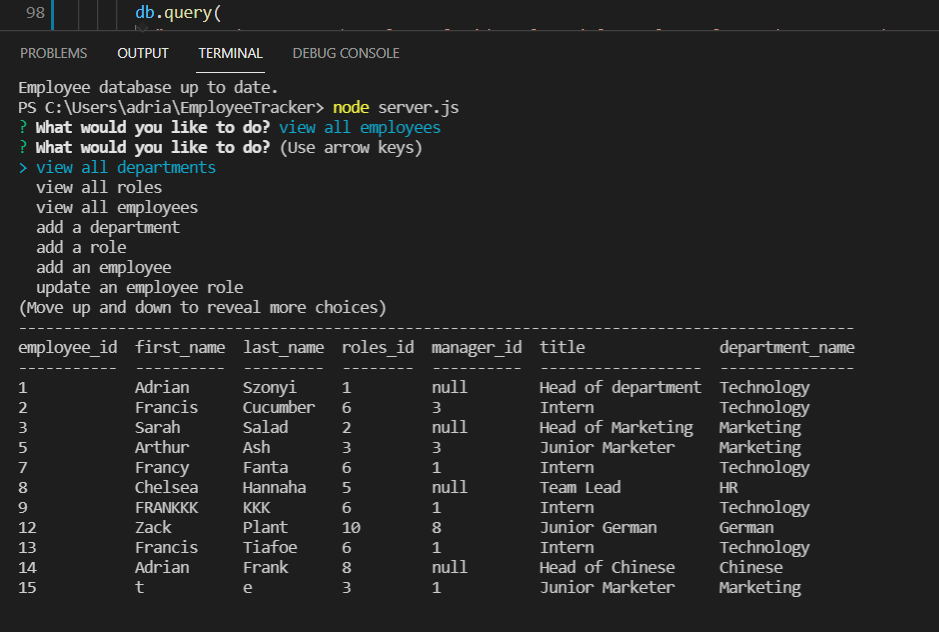

# Employee Database Manager

## Table of Contents

- [Description](#Description)
- [Installation](#Installation)
- [Tests](#Tests)
- [Contributing](#Contributing)
- [License](#License)
- [Questions](#Questions)

## Description

I have built an employee management system using inquirer, mysql and console tables. This is running on a node server and once you have installed all the npm packages you can run through the inquirer prompts to update an employee database. Users will be able to view multiple joined tables, update records, delete and add new data as well.

screen recording demo: [click_here](https://watch.screencastify.com/v/G8TpNDHUrg1WtOy0Lnaa)

## Installation

The application has been set up to on the node server. You will need to install the relevant npm and login to mysql to set up the database.

## Tests

Please install Jest to run the test files

## Contributing

Adrian Szonyi

## License

The MIT License (MIT) Copyright (c) 2015 Chris Kibble Permission is hereby granted, free of charge, to any person obtaining a copy of this software and associated documentation files (the Software), to deal in the Software without restriction, including without limitation the rights to use, copy, modify, merge, publish, distribute, sublicense, and/or sell copies of the Software, and to permit persons to whom the Software is furnished to do so, subject to the following conditions The above copyright notice and this permission notice shall be included in all copies or substantial portions of the Software. THE SOFTWARE IS PROVIDED AS IS, WITHOUT WARRANTY OF ANY KIND, EXPRESS OR IMPLIED, INCLUDING BUT NOT LIMITED TO THE WARRANTIES OF MERCHANTABILITY, FITNESS FOR A PARTICULAR PURPOSE AND NONINFRINGEMENT. IN NO EVENT SHALL THE AUTHORS OR COPYRIGHT HOLDERS BE LIABLE FOR ANY CLAIM, DAMAGES OR OTHER LIABILITY, WHETHER IN AN ACTION OF CONTRACT, TORT OR OTHERWISE, ARISING FROM, OUT OF OR IN CONNECTION WITH THE SOFTWARE OR THE USE OR OTHER DEALINGS IN THE SOFTWARE.

## Screenshot

## Questions

My Github Profile link: [_here_](https://github.com/Adrian-szonyi)
if you have any additional questions you can reach me using the details below:

Email: aszonyi49@gmail.com
